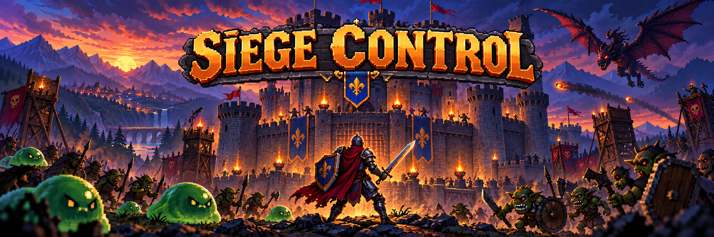

  

# 🏰 Siege Control

## [🎮 Play Siege Control in Your Browser](https://abumaria24.github.io/Siege-Control-Play/)

## [⬇️ Download the Complete Game ZIP](https://github.com/AbuMaria24/Siege-Control-Play/releases/tag/v1.0.0)

**Siege Control** is a 2D action-defense game created with Godot 4. You play as a knight defending a castle from waves of enemies. Fight monsters, collect coins, purchase upgrades, and keep the castle standing until the final battle.

No download is required—open the link above and play directly in a modern desktop browser.

## Game Features

- Fast-paced knight combat
- Multiple enemy types, including slimes and flying enemies
- Increasing enemy waves
- Coins dropped by defeated enemies
- Castle upgrades with three visual levels
- Player damage, castle health, and regeneration upgrades
- Shop system with increasing prices
- Title, pause, victory, and game-over screens
- Music and sound effects
- Final boss battle

## How to Play

Protect the castle by defeating each wave before the enemies destroy it. Collect coins and spend them in the shop to strengthen your knight and castle. Choose your upgrades carefully as the enemies become stronger.

## Controls

| Action | Key |
|---|---|
| Move left | **A** or **Left Arrow** |
| Move right | **D** or **Right Arrow** |
| Jump | **Space** |
| Attack | **F** |
| Block | **E** |

## Technology

- Godot 4.5
- GDScript
- HTML5 / WebAssembly export

> For the best experience, play on a desktop or laptop using an updated version of Chrome, Firefox, Edge, or Safari.
